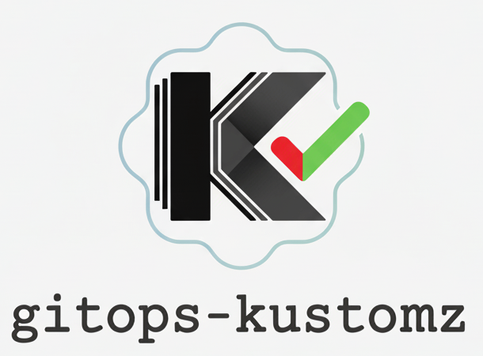

# gitops-kustomz

<p align="center">
  
</p>

GitOps policy enforcement tool for Kubernetes manifests managed with Kustomize.


## Overview

`gitops-kustomz` is designed to run in GitHub Actions CI on Pull Requests. It analyzes Kubernetes manifest changes managed with Kustomize, enforces OPA policies, and provides detailed feedback via PR comments.

## Features

- 🔍 **Kustomize Build & Diff**: Builds manifests from base and head branches, generates clear diffs
- 📋 **Policy Enforcement**: Evaluates OPA policies with configurable enforcement levels (RECOMMEND/WARNING/BLOCK)
- 💬 **GitHub Integration**: Posts detailed policy reports and diffs as PR comments
- ⚡ **Fast**: Parallel policy evaluation with goroutines, <2s build time target
- 🧪 **Local Testing**: Test policies locally without GitHub PR

## Quick Start

### GitHub Actions (Recommended)

Copy one of the sample workflows to your GitOps repository:

```bash
# Copy workflow to your repo
cp sample/github-actions/gitops-policy-check-multi-env.yml \
   .github/workflows/gitops-policy-check.yml
```

See [sample/github-actions/README.md](./sample/github-actions/README.md) for detailed setup instructions.

### CLI Usage

```bash
# Run on a PR (GitHub mode)
gitops-kustomz \
  --run-mode github \
  --gh-repo owner/repo \
  --gh-pr-number 123 \
  --service my-app \
  --environments stg,prod \
  --manifests-path ./services \
  --policies-path ./policies

# Local testing
gitops-kustomz \
  --run-mode local \
  --service my-app \
  --environments stg,prod \
  --lc-before-manifests-path ./before/services \
  --lc-after-manifests-path ./after/services \
  --policies-path ./policies \
  --lc-output-dir ./output
```

## 📁 Project Structure

```
.
├── src/
│   ├── cmd/gitops-kustomz/    # CLI entry point
│   ├── pkg/                   # Core packages
│   │   ├── config/            # Configuration types
│   │   ├── diff/              # Manifest diffing
│   │   ├── github/            # GitHub API client
│   │   ├── kustomize/         # Kustomize builder
│   │   ├── policy/            # Policy evaluation (OPA)
│   │   └── template/          # Markdown templating
│   ├── internal/              # Internal utilities
│   └── templates/             # Default markdown templates
├── sample/                    # Example policies & manifests
├── test/                      # Test data
├── go.mod                     # Go module definition
└── Makefile                   # Build automation
```

## Template Customization

The tool supports custom markdown templates for GitHub comments. Templates use Go's `text/template` syntax with rich data structures.

### Quick Template Examples

```go
// Service and environment info
{{.Service}} - {{range .Environments}}{{.}} {{end}}

// Timestamp formatting
{{.Timestamp.Format "2006-01-02 15:04:05 UTC"}}

// Conditional rendering
{{if gt .MultiEnvPolicyReport.Summary.stg.FailedPolicies 0}}
  ⚠️ Staging has failed policies
{{end}}

// Policy status matrix
{{range .MultiEnvPolicyReport.Policies}}
  {{.Name}}: {{.Level}}
{{end}}
```

See [docs/TEMPLATE_VARIABLES.md](./docs/TEMPLATE_VARIABLES.md) for complete reference.

## Documentation

- [sample/github-actions/README.md](./sample/github-actions/README.md) - **GitHub Actions setup guide**
- [docs/ARCHITECTURE.md](./docs/ARCHITECTURE.md) - High-level architecture and use cases
- [docs/DESIGN.md](./docs/DESIGN.md) - Detailed design and implementation specs
- [docs/TEMPLATE_VARIABLES.md](./docs/TEMPLATE_VARIABLES.md) - **Template variables and functions reference**
- [LOCAL_TESTING.md](./LOCAL_TESTING.md) - Local testing guide

## Requirements

- Go 1.22+
- `kustomize` binary in PATH
- GitHub token with PR comment permissions (for CI mode)

## Installation

```bash
go install github.com/gh-nvat/gitops-kustomz@latest
```

## Development

```bash
# Clone the repo
git clone https://github.com/gh-nvat/gitops-kustomz.git
cd gitops-kustomz

# Build
make build

# Run tests
make test

# Run linter
make lint

# Local testing mode
make run-local
```

## License

MIT


